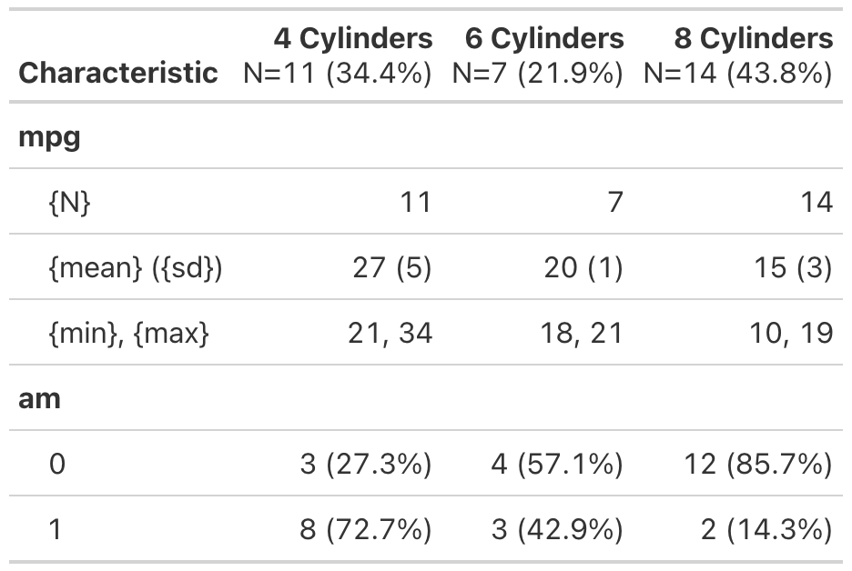

<!-- README.md is generated from README.Rmd. Please edit that file -->

```{r, include = FALSE}
knitr::opts_chunk$set(
  collapse = TRUE,
  comment = "#>",
  fig.path = "man/figures/README-",
  out.width = "100%"
)
```

# cards

<!-- badges: start -->
<!-- [](https://github.com/insightsengineering/cards/actions/workflows/R-CMD-check.yaml) -->
<!-- [](https://app.codecov.io/gh/insightsengineering/cards?branch=main) -->
<!-- badges: end -->

The {cards} package creates CDISC Analysis Result Data (ARD).

**This package is in a preliminary state, and breaking change will be made without notice or deprecation.**

## Installation

You can install the development version of cards from [GitHub](https://github.com/) with:

``` r
# install.packages("devtools")
devtools::install_github("insightsengineering/cards")
```

## Example

ARD Examples

```{r example}
library(cards)
library(dplyr) |> suppressPackageStartupMessages()

ard_continuous(mtcars, by = "cyl", variables = c("mpg", "hp")) |> 
  flatten_ard()

ard_categorical(mtcars, by = "cyl", variables = c("am", "gear")) |> 
  flatten_ard()

ard_ttest(data = mtcars, by = "am", variable = "hp") |> 
  flatten_ard()

glm(am ~ mpg + factor(cyl), data = mtcars, family = binomial) |>
  ard_regression(add_estimate_to_reference_rows = TRUE) |> 
  flatten_ard()
```

<!-- ARD  -> Table Example -->

<!-- ```{r} -->
<!-- # Construct the ARD -->
<!-- table_ard <- -->
<!--   bind_rows( -->
<!--     ard_continuous(mtcars, by = cyl, variables = "mpg"), -->
<!--     ard_categorical(mtcars, by = cyl, variables = "am"), -->
<!--     ard_categorical(mtcars, variables = "cyl") -->
<!--   ) -->

<!-- # convert ARD to a cards table -->
<!-- table <- -->
<!--   construct_cards( -->
<!--     table_plan = -->
<!--       bind_rows( -->
<!--         table_ard |> filter(variable %in% "mpg") |>  table_plan_simple_continuous(), -->
<!--         table_ard |> filter(variable %in% "am") |> table_plan_simple_categorical() -->
<!--       ), -->
<!--     header_plan = -->
<!--       table_ard |> -->
<!--       filter(variable %in% "cyl") |> -->
<!--       header_plan_simple(header = "**{strata} Cylinders**  \nN={n}  ({p}%)") |> -->
<!--       modifyList(val = list(label = gt::md("**Characteristic**"))) -->
<!--   ) |> -->
<!--   convert_cards(engine = "gt") -->
<!-- ``` -->

<!-- ```{r echo=FALSE, fig.width=4} -->
<!-- gt::gtsave(table, filename = "man/figures/README-table_example.png") -->
<!-- ``` -->

<!--  -->
