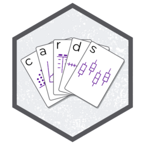

<!-- README.md is generated from README.Rmd. Please edit that file -->

# cards <a href="https://insightsengineering.github.io/cards/"></a>

<!-- badges: start -->

[](https://CRAN.R-project.org/package=cards)
[](https://app.codecov.io/gh/insightsengineering/cards)
[](https://cran.r-project.org/package=cards)
[](https://github.com/insightsengineering/cards/actions/workflows/R-CMD-check.yaml)
<!-- badges: end -->

The [CDISC Analysis Results
Standard](https://www.cdisc.org/standards/foundational/analysis-results-standard)
aims to facilitate automation, reproducibility, reusability, and
traceability of analysis results data (ARD). The {cards} package creates
these **C**DISC **A**nalysis **R**esult **D**ata **S**ets.

Use cases:

1.  Quality Control (QC) of existing tables and figures.

2.  Pre-calculate statistics to be summarized in tables and figures.

3.  Medical writers may easily access statistics and place in reports
    without copying and pasting from reports.

4.  Provides a consistent format for results and lends results to be
    combined across studies for re-use and re-analysis.

## Installation

Install cards from CRAN with:

``` r
install.packages("cards")
```

You can install the development version of cards from
[GitHub](https://github.com/) with:

``` r
# install.packages("devtools")
devtools::install_github("insightsengineering/cards")
```

## Extensions

[](https://insightsengineering.github.io/cardx/)

The {cards} package exports three types of functions:

1.  Functions to create basic ARD objects.

2.  Utilities to create new ARD objects.

3.  Functions to work with existing ARD objects.

The [{cardx}](https://github.com/insightsengineering/cardx/) R package
is an extension to {cards} that uses the utilities from {cards} and
exports functions for creating additional ARD objects––including
functions to summarize t-tests, Wilcoxon Rank-Sum tests, regression
models, and more.

## Getting Started

Review the [Getting
Started](https://insightsengineering.github.io/cards//main/articles/getting-started.html)
page for examples using ARDs to calculate statistics to later include in
tables.

``` r
library(cards)

ard_continuous(ADSL, by = "ARM", variables = "AGE")
#> {cards} data frame: 24 x 10
#>    group1 group1_level variable stat_name stat_label   stat
#> 1     ARM      Placebo      AGE         N          N     86
#> 2     ARM      Placebo      AGE      mean       Mean 75.209
#> 3     ARM      Placebo      AGE        sd         SD   8.59
#> 4     ARM      Placebo      AGE    median     Median     76
#> 5     ARM      Placebo      AGE       p25         Q1     69
#> 6     ARM      Placebo      AGE       p75         Q3     82
#> 7     ARM      Placebo      AGE       min        Min     52
#> 8     ARM      Placebo      AGE       max        Max     89
#> 9     ARM    Xanomeli…      AGE         N          N     84
#> 10    ARM    Xanomeli…      AGE      mean       Mean 74.381
#> ℹ 14 more rows
#> ℹ Use `print(n = ...)` to see more rows
#> ℹ 4 more variables: context, fmt_fn, warning, error
```

## Other Resources

<div id="zsqyphfbea" style="padding-left:0px;padding-right:0px;padding-top:10px;padding-bottom:10px;overflow-x:auto;overflow-y:auto;width:auto;height:auto;">
<style>#zsqyphfbea table {
  font-family: system-ui, 'Segoe UI', Roboto, Helvetica, Arial, sans-serif, 'Apple Color Emoji', 'Segoe UI Emoji', 'Segoe UI Symbol', 'Noto Color Emoji';
  -webkit-font-smoothing: antialiased;
  -moz-osx-font-smoothing: grayscale;
}
&#10;#zsqyphfbea thead, #zsqyphfbea tbody, #zsqyphfbea tfoot, #zsqyphfbea tr, #zsqyphfbea td, #zsqyphfbea th {
  border-style: none;
}
&#10;#zsqyphfbea p {
  margin: 0;
  padding: 0;
}
&#10;#zsqyphfbea .gt_table {
  display: table;
  border-collapse: collapse;
  line-height: normal;
  margin-left: auto;
  margin-right: auto;
  color: #333333;
  font-size: 16px;
  font-weight: normal;
  font-style: normal;
  background-color: #FFFFFF;
  width: auto;
  border-top-style: solid;
  border-top-width: 2px;
  border-top-color: #A8A8A8;
  border-right-style: none;
  border-right-width: 2px;
  border-right-color: #D3D3D3;
  border-bottom-style: solid;
  border-bottom-width: 2px;
  border-bottom-color: #A8A8A8;
  border-left-style: none;
  border-left-width: 2px;
  border-left-color: #D3D3D3;
}
&#10;#zsqyphfbea .gt_caption {
  padding-top: 4px;
  padding-bottom: 4px;
}
&#10;#zsqyphfbea .gt_title {
  color: #333333;
  font-size: 125%;
  font-weight: initial;
  padding-top: 4px;
  padding-bottom: 4px;
  padding-left: 5px;
  padding-right: 5px;
  border-bottom-color: #FFFFFF;
  border-bottom-width: 0;
}
&#10;#zsqyphfbea .gt_subtitle {
  color: #333333;
  font-size: 85%;
  font-weight: initial;
  padding-top: 3px;
  padding-bottom: 5px;
  padding-left: 5px;
  padding-right: 5px;
  border-top-color: #FFFFFF;
  border-top-width: 0;
}
&#10;#zsqyphfbea .gt_heading {
  background-color: #FFFFFF;
  text-align: center;
  border-bottom-color: #FFFFFF;
  border-left-style: none;
  border-left-width: 1px;
  border-left-color: #D3D3D3;
  border-right-style: none;
  border-right-width: 1px;
  border-right-color: #D3D3D3;
}
&#10;#zsqyphfbea .gt_bottom_border {
  border-bottom-style: solid;
  border-bottom-width: 2px;
  border-bottom-color: #D3D3D3;
}
&#10;#zsqyphfbea .gt_col_headings {
  border-top-style: solid;
  border-top-width: 2px;
  border-top-color: #D3D3D3;
  border-bottom-style: solid;
  border-bottom-width: 2px;
  border-bottom-color: #D3D3D3;
  border-left-style: none;
  border-left-width: 1px;
  border-left-color: #D3D3D3;
  border-right-style: none;
  border-right-width: 1px;
  border-right-color: #D3D3D3;
}
&#10;#zsqyphfbea .gt_col_heading {
  color: #333333;
  background-color: #FFFFFF;
  font-size: 100%;
  font-weight: normal;
  text-transform: inherit;
  border-left-style: none;
  border-left-width: 1px;
  border-left-color: #D3D3D3;
  border-right-style: none;
  border-right-width: 1px;
  border-right-color: #D3D3D3;
  vertical-align: bottom;
  padding-top: 5px;
  padding-bottom: 6px;
  padding-left: 5px;
  padding-right: 5px;
  overflow-x: hidden;
}
&#10;#zsqyphfbea .gt_column_spanner_outer {
  color: #333333;
  background-color: #FFFFFF;
  font-size: 100%;
  font-weight: normal;
  text-transform: inherit;
  padding-top: 0;
  padding-bottom: 0;
  padding-left: 4px;
  padding-right: 4px;
}
&#10;#zsqyphfbea .gt_column_spanner_outer:first-child {
  padding-left: 0;
}
&#10;#zsqyphfbea .gt_column_spanner_outer:last-child {
  padding-right: 0;
}
&#10;#zsqyphfbea .gt_column_spanner {
  border-bottom-style: solid;
  border-bottom-width: 2px;
  border-bottom-color: #D3D3D3;
  vertical-align: bottom;
  padding-top: 5px;
  padding-bottom: 5px;
  overflow-x: hidden;
  display: inline-block;
  width: 100%;
}
&#10;#zsqyphfbea .gt_spanner_row {
  border-bottom-style: hidden;
}
&#10;#zsqyphfbea .gt_group_heading {
  padding-top: 8px;
  padding-bottom: 8px;
  padding-left: 5px;
  padding-right: 5px;
  color: #333333;
  background-color: #FFFFFF;
  font-size: 100%;
  font-weight: initial;
  text-transform: inherit;
  border-top-style: solid;
  border-top-width: 2px;
  border-top-color: #D3D3D3;
  border-bottom-style: solid;
  border-bottom-width: 2px;
  border-bottom-color: #D3D3D3;
  border-left-style: none;
  border-left-width: 1px;
  border-left-color: #D3D3D3;
  border-right-style: none;
  border-right-width: 1px;
  border-right-color: #D3D3D3;
  vertical-align: middle;
  text-align: left;
}
&#10;#zsqyphfbea .gt_empty_group_heading {
  padding: 0.5px;
  color: #333333;
  background-color: #FFFFFF;
  font-size: 100%;
  font-weight: initial;
  border-top-style: solid;
  border-top-width: 2px;
  border-top-color: #D3D3D3;
  border-bottom-style: solid;
  border-bottom-width: 2px;
  border-bottom-color: #D3D3D3;
  vertical-align: middle;
}
&#10;#zsqyphfbea .gt_from_md > :first-child {
  margin-top: 0;
}
&#10;#zsqyphfbea .gt_from_md > :last-child {
  margin-bottom: 0;
}
&#10;#zsqyphfbea .gt_row {
  padding-top: 8px;
  padding-bottom: 8px;
  padding-left: 5px;
  padding-right: 5px;
  margin: 10px;
  border-top-style: solid;
  border-top-width: 1px;
  border-top-color: #D3D3D3;
  border-left-style: none;
  border-left-width: 1px;
  border-left-color: #D3D3D3;
  border-right-style: none;
  border-right-width: 1px;
  border-right-color: #D3D3D3;
  vertical-align: middle;
  overflow-x: hidden;
}
&#10;#zsqyphfbea .gt_stub {
  color: #333333;
  background-color: #FFFFFF;
  font-size: 100%;
  font-weight: initial;
  text-transform: inherit;
  border-right-style: solid;
  border-right-width: 2px;
  border-right-color: #D3D3D3;
  padding-left: 5px;
  padding-right: 5px;
}
&#10;#zsqyphfbea .gt_stub_row_group {
  color: #333333;
  background-color: #FFFFFF;
  font-size: 100%;
  font-weight: initial;
  text-transform: inherit;
  border-right-style: solid;
  border-right-width: 2px;
  border-right-color: #D3D3D3;
  padding-left: 5px;
  padding-right: 5px;
  vertical-align: top;
}
&#10;#zsqyphfbea .gt_row_group_first td {
  border-top-width: 2px;
}
&#10;#zsqyphfbea .gt_row_group_first th {
  border-top-width: 2px;
}
&#10;#zsqyphfbea .gt_summary_row {
  color: #333333;
  background-color: #FFFFFF;
  text-transform: inherit;
  padding-top: 8px;
  padding-bottom: 8px;
  padding-left: 5px;
  padding-right: 5px;
}
&#10;#zsqyphfbea .gt_first_summary_row {
  border-top-style: solid;
  border-top-color: #D3D3D3;
}
&#10;#zsqyphfbea .gt_first_summary_row.thick {
  border-top-width: 2px;
}
&#10;#zsqyphfbea .gt_last_summary_row {
  padding-top: 8px;
  padding-bottom: 8px;
  padding-left: 5px;
  padding-right: 5px;
  border-bottom-style: solid;
  border-bottom-width: 2px;
  border-bottom-color: #D3D3D3;
}
&#10;#zsqyphfbea .gt_grand_summary_row {
  color: #333333;
  background-color: #FFFFFF;
  text-transform: inherit;
  padding-top: 8px;
  padding-bottom: 8px;
  padding-left: 5px;
  padding-right: 5px;
}
&#10;#zsqyphfbea .gt_first_grand_summary_row {
  padding-top: 8px;
  padding-bottom: 8px;
  padding-left: 5px;
  padding-right: 5px;
  border-top-style: double;
  border-top-width: 6px;
  border-top-color: #D3D3D3;
}
&#10;#zsqyphfbea .gt_last_grand_summary_row_top {
  padding-top: 8px;
  padding-bottom: 8px;
  padding-left: 5px;
  padding-right: 5px;
  border-bottom-style: double;
  border-bottom-width: 6px;
  border-bottom-color: #D3D3D3;
}
&#10;#zsqyphfbea .gt_striped {
  background-color: rgba(128, 128, 128, 0.05);
}
&#10;#zsqyphfbea .gt_table_body {
  border-top-style: solid;
  border-top-width: 2px;
  border-top-color: #D3D3D3;
  border-bottom-style: solid;
  border-bottom-width: 2px;
  border-bottom-color: #D3D3D3;
}
&#10;#zsqyphfbea .gt_footnotes {
  color: #333333;
  background-color: #FFFFFF;
  border-bottom-style: none;
  border-bottom-width: 2px;
  border-bottom-color: #D3D3D3;
  border-left-style: none;
  border-left-width: 2px;
  border-left-color: #D3D3D3;
  border-right-style: none;
  border-right-width: 2px;
  border-right-color: #D3D3D3;
}
&#10;#zsqyphfbea .gt_footnote {
  margin: 0px;
  font-size: 90%;
  padding-top: 4px;
  padding-bottom: 4px;
  padding-left: 5px;
  padding-right: 5px;
}
&#10;#zsqyphfbea .gt_sourcenotes {
  color: #333333;
  background-color: #FFFFFF;
  border-bottom-style: none;
  border-bottom-width: 2px;
  border-bottom-color: #D3D3D3;
  border-left-style: none;
  border-left-width: 2px;
  border-left-color: #D3D3D3;
  border-right-style: none;
  border-right-width: 2px;
  border-right-color: #D3D3D3;
}
&#10;#zsqyphfbea .gt_sourcenote {
  font-size: 90%;
  padding-top: 4px;
  padding-bottom: 4px;
  padding-left: 5px;
  padding-right: 5px;
}
&#10;#zsqyphfbea .gt_left {
  text-align: left;
}
&#10;#zsqyphfbea .gt_center {
  text-align: center;
}
&#10;#zsqyphfbea .gt_right {
  text-align: right;
  font-variant-numeric: tabular-nums;
}
&#10;#zsqyphfbea .gt_font_normal {
  font-weight: normal;
}
&#10;#zsqyphfbea .gt_font_bold {
  font-weight: bold;
}
&#10;#zsqyphfbea .gt_font_italic {
  font-style: italic;
}
&#10;#zsqyphfbea .gt_super {
  font-size: 65%;
}
&#10;#zsqyphfbea .gt_footnote_marks {
  font-size: 75%;
  vertical-align: 0.4em;
  position: initial;
}
&#10;#zsqyphfbea .gt_asterisk {
  font-size: 100%;
  vertical-align: 0;
}
&#10;#zsqyphfbea .gt_indent_1 {
  text-indent: 5px;
}
&#10;#zsqyphfbea .gt_indent_2 {
  text-indent: 10px;
}
&#10;#zsqyphfbea .gt_indent_3 {
  text-indent: 15px;
}
&#10;#zsqyphfbea .gt_indent_4 {
  text-indent: 20px;
}
&#10;#zsqyphfbea .gt_indent_5 {
  text-indent: 25px;
}
&#10;#zsqyphfbea .katex-display {
  display: inline-flex !important;
  margin-bottom: 0.75em !important;
}
&#10;#zsqyphfbea div.Reactable > div.rt-table > div.rt-thead > div.rt-tr.rt-tr-group-header > div.rt-th-group:after {
  height: 0px !important;
}
</style>
<table class="gt_table" data-quarto-disable-processing="false" data-quarto-bootstrap="false">
  &#10;  <tbody class="gt_table_body">
    <tr><td headers="venue" class="gt_row gt_left"><span class='gt_from_md'>2025 PHUSE US Connect</span></td>
<td headers="title" class="gt_row gt_left"><span class='gt_from_md'>Analysis Results Datasets Using Open-Source Tools from the {pharmaverse}</span></td>
<td headers="url_slides" class="gt_row gt_center"><span style="white-space: pre;"><a href="https://www.danieldsjoberg.com/ARD-PHUSE-workshop-2025/" target="_blank" style="color:#008B8B;text-decoration:underline;text-underline-position: under;display: inline-block;"><svg aria-hidden="true" role="img" viewBox="0 0 576 512" style="height:1em;width:1.12em;vertical-align:-0.125em;margin-left:auto;margin-right:auto;font-size:inherit;fill:#808080;overflow:visible;position:relative;"><path d="M64 0C28.7 0 0 28.7 0 64V352c0 35.3 28.7 64 64 64H240l-10.7 32H160c-17.7 0-32 14.3-32 32s14.3 32 32 32H416c17.7 0 32-14.3 32-32s-14.3-32-32-32H346.7L336 416H512c35.3 0 64-28.7 64-64V64c0-35.3-28.7-64-64-64H64zM512 64V352H64V64H512z"/></svg></a></span></td>
<td headers="url_video" class="gt_row gt_center"><br /></td></tr>
    <tr><td headers="venue" class="gt_row gt_left"><span class='gt_from_md'>2024 R/Pharma</span></td>
<td headers="title" class="gt_row gt_left"><span class='gt_from_md'>Harnessing CDISC’s Emerging Analysis Results Datasets Standard</span></td>
<td headers="url_slides" class="gt_row gt_center"><span style="white-space: pre;"><a href="https://www.danieldsjoberg.com/ARD-RinPharma-talk-2024/" target="_blank" style="color:#008B8B;text-decoration:underline;text-underline-position: under;display: inline-block;"><svg aria-hidden="true" role="img" viewBox="0 0 576 512" style="height:1em;width:1.12em;vertical-align:-0.125em;margin-left:auto;margin-right:auto;font-size:inherit;fill:#808080;overflow:visible;position:relative;"><path d="M64 0C28.7 0 0 28.7 0 64V352c0 35.3 28.7 64 64 64H240l-10.7 32H160c-17.7 0-32 14.3-32 32s14.3 32 32 32H416c17.7 0 32-14.3 32-32s-14.3-32-32-32H346.7L336 416H512c35.3 0 64-28.7 64-64V64c0-35.3-28.7-64-64-64H64zM512 64V352H64V64H512z"/></svg></a></span></td>
<td headers="url_video" class="gt_row gt_center"><span style="white-space: pre;"><a href="https://www.youtube.com/watch?v=tDb6O6a5lbc" target="_blank" style="color:#008B8B;text-decoration:underline;text-underline-position: under;display: inline-block;"><svg aria-hidden="true" role="img" viewBox="0 0 576 512" style="height:1em;width:1.12em;vertical-align:-0.125em;margin-left:auto;margin-right:auto;font-size:inherit;fill:#808080;overflow:visible;position:relative;"><path d="M549.655 124.083c-6.281-23.65-24.787-42.276-48.284-48.597C458.781 64 288 64 288 64S117.22 64 74.629 75.486c-23.497 6.322-42.003 24.947-48.284 48.597-11.412 42.867-11.412 132.305-11.412 132.305s0 89.438 11.412 132.305c6.281 23.65 24.787 41.5 48.284 47.821C117.22 448 288 448 288 448s170.78 0 213.371-11.486c23.497-6.321 42.003-24.171 48.284-47.821 11.412-42.867 11.412-132.305 11.412-132.305s0-89.438-11.412-132.305zm-317.51 213.508V175.185l142.739 81.205-142.739 81.201z"/></svg></a></span></td></tr>
    <tr><td headers="venue" class="gt_row gt_left"><span class='gt_from_md'>2024 R/Pharma</span></td>
<td headers="title" class="gt_row gt_left"><span class='gt_from_md'>Workshop: Unlocking Analysis Results Datasets</span></td>
<td headers="url_slides" class="gt_row gt_center"><span style="white-space: pre;"><a href="https://www.danieldsjoberg.com/ARD-RinPharma-workshop-2024/" target="_blank" style="color:#008B8B;text-decoration:underline;text-underline-position: under;display: inline-block;"><svg aria-hidden="true" role="img" viewBox="0 0 576 512" style="height:1em;width:1.12em;vertical-align:-0.125em;margin-left:auto;margin-right:auto;font-size:inherit;fill:#808080;overflow:visible;position:relative;"><path d="M64 0C28.7 0 0 28.7 0 64V352c0 35.3 28.7 64 64 64H240l-10.7 32H160c-17.7 0-32 14.3-32 32s14.3 32 32 32H416c17.7 0 32-14.3 32-32s-14.3-32-32-32H346.7L336 416H512c35.3 0 64-28.7 64-64V64c0-35.3-28.7-64-64-64H64zM512 64V352H64V64H512z"/></svg></a></span></td>
<td headers="url_video" class="gt_row gt_center"><br /></td></tr>
    <tr><td headers="venue" class="gt_row gt_left"><span class='gt_from_md'><code>posit::conf(2024)</code></span></td>
<td headers="title" class="gt_row gt_left"><span class='gt_from_md'>{pharmaverse} workshop</span></td>
<td headers="url_slides" class="gt_row gt_center"><span style="white-space: pre;"><a href="https://posit-conf-2024.github.io/pharmaverse/#schedule" target="_blank" style="color:#008B8B;text-decoration:underline;text-underline-position: under;display: inline-block;"><svg aria-hidden="true" role="img" viewBox="0 0 576 512" style="height:1em;width:1.12em;vertical-align:-0.125em;margin-left:auto;margin-right:auto;font-size:inherit;fill:#808080;overflow:visible;position:relative;"><path d="M64 0C28.7 0 0 28.7 0 64V352c0 35.3 28.7 64 64 64H240l-10.7 32H160c-17.7 0-32 14.3-32 32s14.3 32 32 32H416c17.7 0 32-14.3 32-32s-14.3-32-32-32H346.7L336 416H512c35.3 0 64-28.7 64-64V64c0-35.3-28.7-64-64-64H64zM512 64V352H64V64H512z"/></svg></a></span></td>
<td headers="url_video" class="gt_row gt_center"><br /></td></tr>
    <tr><td headers="venue" class="gt_row gt_left"><span class='gt_from_md'>2024 China Pharma R User Conference</span></td>
<td headers="title" class="gt_row gt_left"><span class='gt_from_md'>Keynote Address</span></td>
<td headers="url_slides" class="gt_row gt_center"><span style="white-space: pre;"><a href="https://www.danieldsjoberg.com/china-pharma-keynote-2024/material.html" target="_blank" style="color:#008B8B;text-decoration:underline;text-underline-position: under;display: inline-block;"><svg aria-hidden="true" role="img" viewBox="0 0 576 512" style="height:1em;width:1.12em;vertical-align:-0.125em;margin-left:auto;margin-right:auto;font-size:inherit;fill:#808080;overflow:visible;position:relative;"><path d="M64 0C28.7 0 0 28.7 0 64V352c0 35.3 28.7 64 64 64H240l-10.7 32H160c-17.7 0-32 14.3-32 32s14.3 32 32 32H416c17.7 0 32-14.3 32-32s-14.3-32-32-32H346.7L336 416H512c35.3 0 64-28.7 64-64V64c0-35.3-28.7-64-64-64H64zM512 64V352H64V64H512z"/></svg></a></span></td>
<td headers="url_video" class="gt_row gt_center"><br /></td></tr>
  </tbody>
  &#10;  
</table>
</div>
